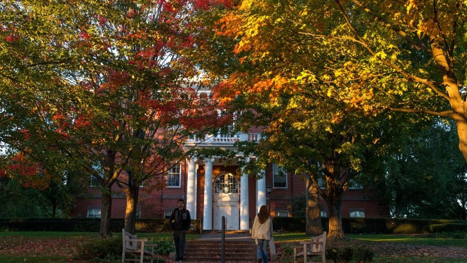



<pre>
</pre>

Work experience
======

**Computational Biologist**: *Memorial Sloan Kettering Cancer Center*
* August 2020 - August 2021
* Supervisor: Christina Leslie, PhD

**Research Assistant**: *BCB Lab at Tufts University*
* May 2019 - June 2020
* Supervisor: Professor Lenore Cowen
  
**Software Engineering Intern**: *Rocket Software*
* June 2018 - September 2018 

**High Performance Computing Intern**: *Hewlett Packard Enterprise*
* June 2017 - September 2017

Education
======

**Princeton University**: *Department of Computer Science*
* August 2021 - Present
* PhD Candidate

**Tufts University**: *Department of Computer Science and Department of Mathematics*
* August 2016 - May 2020
* Bachelor of Science, 3.77 GPA

Teaching
======
  

**COMP 40 - Machine Structure and Assembly Language**: *Tufts University*
* Fall 2017 

**COMP 150 - Network Science**: *Tufts University*
* Fall 2019 

