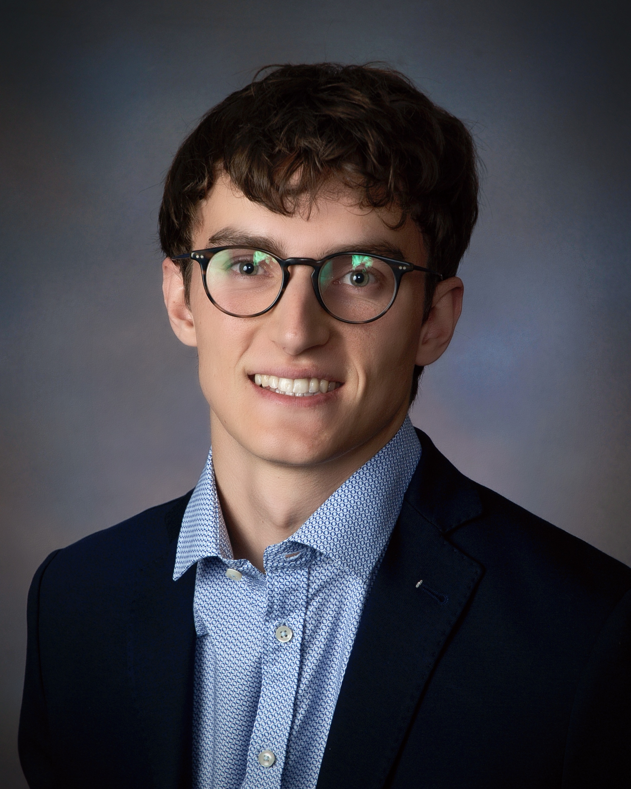

    

    

        <a href="https://github.com/schmidt73" target="_blank">
            <i class="fab fa-github-square fa-3x"></i>
        </a>
        <a href="https://scholar.google.com/citations?user=tovcdNcAAAAJ" target="_blank">
            <i class="ai ai-google-scholar ai-3x"></i>
        </a>
        <a href="https://orcid.org/0000-0002-0132-3472" target="_blank">
            <i class="ai ai-orcid ai-3x"></i>
        </a>
        <a href="mailto:henri.schmidt@princeton.edu" target="_blank">
            <i class="fa-solid fa-envelope fa-3x"></i>
        </a>
    

I am a PhD candidate in Computer Science at [Princeton
University](https://www.cs.princeton.edu). I am very fortunate to be advised by
[Ben Raphael](https://www.cs.princeton.edu/people/profile/braphael). Prior to working with
Ben Raphael, I completed a Bachelor of Science in Math and Computer Science
at [Tufts University](https://www.tufts.edu/), where I worked with 
[Lenore Cowen](https://www.cs.tufts.edu/~cowen/) on protein-to-protein interaction
graphs.

I am broadly interested in employing techniques from theoretical computer science
to study algorithmic problems in computational biology. More specifically, I study
combinatorial optimization problems that arise in computational phylogenetics.
Currently, I am working on *i)* designing fast algorithms 
for the [clone tree regression problem](https://academic.oup.com/bioinformatics/article/31/12/i62/216528)
and *ii)* applying the theory of network flows to solve constrained [tree
coloring](https://www.sciencedirect.com/science/article/pii/S0022000007001468) problems.

<h2 style="margin-top:0px;"><i>Recent Updates</i></h2>

<ul>
<li>(August 2023) The ZCNT paper was published in <a href="https://doi.org/10.1371/journal.pcbi.1011590">PLOS Computational Biology</a>.</li>
<li>(May 2023) Presented my work on the <i>zero agnostic copy number transformation (ZCNT)</i> model at the 
<a href="https://www.birs.ca/events/2023/5-day-workshops/23w5084/schedule">Banff International Research Station for
Mathematical Innovation and Discovery</a>.</li>
<li>(April 2023) Presented my work on <i>Startle</i> and <i>ZCNT</i> at <a href="http://recomb2023.bilkent.edu.tr/index.html">RECOMB-2023</a> and 
the <a href="https://sites.google.com/view/recomb-ccb2023">RECOMB-2023</a> satellite for computational cancer biology.</li>
<li>(March 2023) Received an Honorable Mention in the <a href="https://www.research.gov/grfp/AwardeeList.do?method=loadAwardeeList">NSF GRFP</a> fellowship competition.</li>
</ul>

<h2 style="margin-top:20px;"><i>Conference Publications</i></h2>

* denotes joint first authorship.

[A zero agnostic model for copy number evolution in cancer](https://www.biorxiv.org/content/10.1101/2023.04.10.536302v1)     
**Henri Schmidt**, Palash Sashittal, Benjamin J. Raphael     
RECOMB Satellite Workshop on Computational Cancer Biology, RECOMB-CCB 2023 [[slides](slides/zcnt.pdf)].   
***Best Paper Award***

[<i>Startle</i>: A star homoplasy approach for CRISPR-Cas9 Lineage Tracing](https://www.biorxiv.org/content/10.1101/2022.12.18.520935v1.abstract)     
**Henri Schmidt\***, Palash Sashittal\*, Michelle Chan, Benjamin J. Raphael     
International Conference on Research in Computational Molecular Biology, RECOMB 2023 [[slides](slides/startle.pdf)].

<h2 style="margin-top:0px;"><i>Journal Publications</i></h2>

[A zero agnostic model for copy number evolution in cancer](https://journals.plos.org/ploscompbiol/article?id=10.1371/journal.pcbi.1011590)     
**Henri Schmidt**, Palash Sashittal, Benjamin J. Raphael 
*PLOS Computational Biology,* November 2023.

[GLIDER: function prediction from GLIDE-based neighborhoods](https://academic.oup.com/bioinformatics/article/38/13/3395/6586285)     
Kapil Devkota, **Henri Schmidt**, Matt Werenski, James M Murphy, Mert Erden, Victor Arsenescu, Lenore J Cowen  
*Bioinformatics,* Volume 38, Issue 13, July 2022, Pages 3395-3406.

[Base editing sensor libraries for high-throughput engineering and functional analysis of cancer-associated single nucleotide variants](https://www.nature.com/articles/s41587-021-01172-3)     
Francisco J Sánchez-Rivera, Bianca J Diaz, Edward R Kastenhuber, **Henri Schmidt**, ..., Scott W. Lowe, Lukas Dow.  
*Nature biotechnology,* Volume 40, Issue 6, June 2022, Pages 862-873.

## Preprints

[Multi-center integrated analysis of non-coding CRISPR screens](https://www.biorxiv.org/content/10.1101/2022.12.21.520137.abstract)     
David Yao, Josh Tycko, ..., **Henri Schmidt**, ..., Michael C. Bassik, Steven K. Reilly   
*bioRxiv,* December 22nd, 2022.

[Genome-wide CRISPR guide RNA design and specificity analysis with GuideScan2](https://www.biorxiv.org/content/10.1101/2022.05.02.490368v1.abstract)     
**Henri Schmidt**, Minsi Zhang, Haralambos Mourelatos, Francisco J. Sánchez-Rivera, Scott W. Lowe, Andrea Ventura, Christina S. Leslie, Yuri Pritykin   
*bioRxiv,* May 3rd, 2022.

&nbsp;
