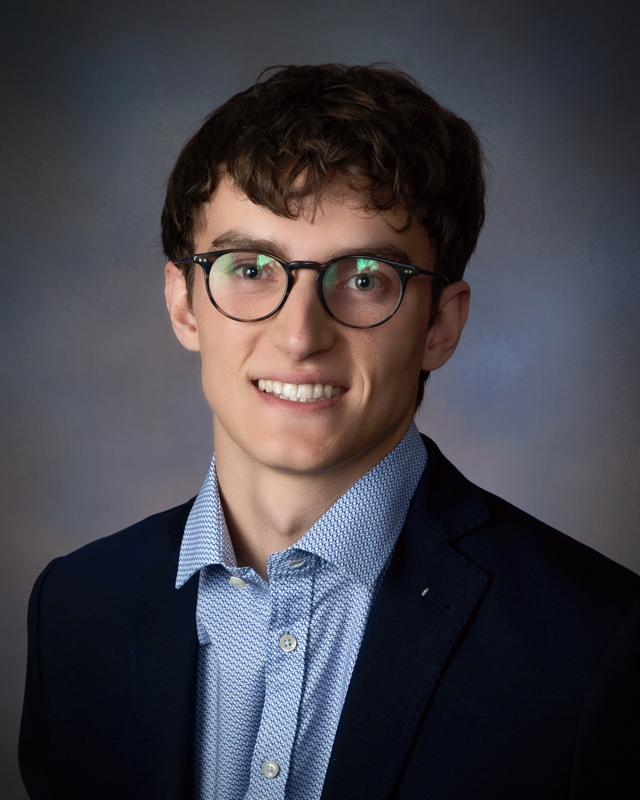

    

    

        <a href="https://scholar.google.com/citations?user=tovcdNcAAAAJ" target="_blank">
            <i class="ai ai-google-scholar ai-2x"></i>
        </a>
        <a href="https://orcid.org/0000-0002-0132-3472" target="_blank">
            <i class="ai ai-orcid ai-2x"></i>
        </a>
        <a href="mailto:henri.schmidt@princeton.edu" target="_blank">
            <i class="fa-solid fa-envelope fa-2x"></i>
        </a>
        <a href="https://github.com/schmidt73" target="_blank">
            <i class="fab fa-github-square fa-2x"></i>
        </a>
        <a href="https://x.com/henrismitch" target="_blank">
            <i class="fab fa-twitter-square fa-2x"></i>
        </a>
    

I am a PhD candidate in Computer Science at [Princeton
University](https://www.cs.princeton.edu). I am very fortunate to be advised by
[Ben Raphael](https://www.cs.princeton.edu/people/profile/braphael). Prior to working with
Ben Raphael, I completed a Bachelor of Science in Math and Computer Science
at [Tufts University](https://www.tufts.edu/), where I worked with 
[Lenore Cowen](https://www.cs.tufts.edu/~cowen/) designing algorithms for 
protein-to-protein interaction networks.

Currently, my research employs techniques from combinatorial
and convex optimization to study problems in biology and machine learning. 
For example, I applied linear and convex optimization techniques to
large-scale phylogenetic problems in cancer evolution ([fastBE](https://doi.org/10.1371/journal.pcbi.1012631))
and ancestral reconstruction ([tree labeling polytope](https://www.biorxiv.org/content/10.1101/2025.02.14.638328v1.abstract)).
More recently, I have applied similar tools to design approximation
algorithms for [low-rank optimal transport](https://openreview.net/pdf?id=YKTJJCNXF4).

<h2 style="margin-top:0px;"><i>Recent Updates</i></h2>

<ul>
<li>(July 2025) I presented our work <a href="https://academic.oup.com/bioinformatics/article/41/Supplement_1/i170/8199380">fastppm</a> at ISMB 2025.</li>
<li>(January 2025) Our preprint <a href="https://www.biorxiv.org/content/10.1101/2025.01.24.634761v1">Fast tumor phylogeny regression via tree-structured dual dynamic programming</a> is now available on bioRxiv.</li>
<li>(December 2024) The <a href="https://www.biorxiv.org/content/10.1101/2025.02.14.638328v1.abstract">tree labeling polytope</a> manuscript was accepted for presentation at <a href="https://recomb.org/recomb2025/">RECOMB2025</a>.</li>
<li>(December 2024) The fastBE manuscript was published in <a href="https://doi.org/10.1371/journal.pcbi.1012631"> PLoS Computational Biology</a>.</li> 
<li>(September 2024) Attended the ICERM workshop regarding <a href="https://icerm.brown.edu/program/semester_program_workshop/sp-f24-w1#workshopparticipants">Current Methods and Open Problems in Mathematical and Statistical Phylogenetics</a>.</li>
</ul>

<h2 style="margin-top:0px;"><i>Journal Publications</i></h2>

* denotes joint first authorship; author order is rearranged with permission from co-authors. 

[Inferring cell differentiation maps from lineage tracing data](https://doi.org/10.1101/2024.09.09.611835)     
Palash Sashittal\*, Richard Y. Zhang\*, Benjamin K. Law, **Henri Schmidt**, Alexander Strzalkowski, Adriano Bolondi, Michelle M. Chan, Benjamin J. Raphael 
*In Press at Nature Methods,* September, 2025. Presented at RECOMB 2025.
&nbsp;

[A graph homomorphism approach for unraveling histories of metastatic cancers and viral outbreaks under evolutionary constraints](https://www.nature.com/articles/s41467-025-63411-4) 
Kiril Kuzmin, **Henri Schmidt**, Maryam Kafi Kang, Sagi Snir, Benjamin J. Raphael, Pavel Skums 
*Nature Communications,* Volume 16, August 2025.

[Maximum likelihood inference of time-scaled cell lineage trees with mixed-type missing data using LAML](https://doi.org/10.1186/s13059-025-03649-9) 
Gillian Chu\*, Uyen Mai\*, **Henri Schmidt**, and Benjamin J. Raphael 
*Genome Biology,* Volume 26, July 2025. Presented at RECOMB 2025.

[Fast tumor phylogeny regression via tree-structured dual dynamic programming](https://academic.oup.com/bioinformatics/article/41/Supplement_1/i170/8199380) 
**Henri Schmidt\***, Yuanyuan Qi\*, Benjamin J. Raphael,and Mohammed El-Kebir 
*Bioinformatics,* Volume 41, July 2025. Presented at ISMB 2025. [[slides](slides/fastppm.pdf)]

[Genome-wide CRISPR guide RNA design and specificity analysis with GuideScan2](https://genomebiology.biomedcentral.com/articles/10.1186/s13059-025-03488-8)     
**Henri Schmidt\***, Minsi Zhang\*, Haralambos Mourelatos, Francisco J. Sánchez-Rivera, Scott W. Lowe, Andrea Ventura, Christina S. Leslie, Yuri Pritykin 
*Genome Biology,* Volume 26, Article 41, February 26, 2025.

[A regression based approach to phylogenetic reconstruction from multi-sample bulk DNA sequencing of tumors](https://doi.org/10.1371/journal.pcbi.1012631)     
**Henri Schmidt** and Benjamin J. Raphael 
*PLoS Computational Biology,* Volume 20, Issue 12, December 2024. [[slides](slides/fastbe.pdf)]

[Multi-center integrated analysis of non-coding CRISPR screens](https://www.nature.com/articles/s41592-024-02216-7)     
David Yao, Josh Tycko, ..., **Henri Schmidt**, ..., Michael C. Bassik, Steven K. Reilly 
*Nature Methods,* Volume 21, Issue 4, Pages 723-734, February 2024.

[<i>Startle</i>: A star homoplasy approach for CRISPR-Cas9 Lineage Tracing](https://doi.org/10.1016/j.cels.2023.11.005)     
**Henri Schmidt\***, Palash Sashittal\*, Michelle Chan, and Benjamin J. Raphael 
*Cell Systems,* Volume 14, Issue 12, December 2023, Pages 1113-1121. Presented at RECOMB 2023. [[slides](slides/startle.pdf)]

[A zero agnostic model for copy number evolution in cancer](https://journals.plos.org/ploscompbiol/article?id=10.1371/journal.pcbi.1011590)     
**Henri Schmidt**, Palash Sashittal, and Benjamin J. Raphael 
*PLoS Computational Biology,* Volume 19, Issue 11, November 2023. [[slides](slides/zcnt.pdf)]   

[GLIDER: function prediction from GLIDE-based neighborhoods](https://academic.oup.com/bioinformatics/article/38/13/3395/6586285)     
Kapil Devkota, **Henri Schmidt**, Matt Werenski, James M Murphy, Mert Erden, Victor Arsenescu, Lenore J. Cowen 
*Bioinformatics,* Volume 38, Issue 13, July 2022, Pages 3395-3406.

[Base editing sensor libraries for high-throughput engineering and functional analysis of cancer-associated single nucleotide variants](https://www.nature.com/articles/s41587-021-01172-3)     
Francisco J. Sánchez-Rivera, Bianca J. Diaz, Edward R. Kastenhuber, **Henri Schmidt**, ..., Scott W. Lowe, Lukas Dow 
*Nature biotechnology,* Volume 40, Issue 6, June 2022, Pages 862-873.

## Conference Papers

[The tree labeling polytope: a unified approach to ancestral reconstruction problems](https://www.biorxiv.org/content/10.1101/2025.02.14.638328v1.abstract) 
**Henri Schmidt** and Benjamin J. Raphael 
*bioRxiv,* February 19th, 2025. Presented at RECOMB 2025. [[slides](slides/tlp.pptx)]

## Manuscripts in preparation

[Transport clustering: solving low-rank optimal transport via clustering](https://openreview.net/forum?id=YKTJJCNXF4) 
**Henri Schmidt\***, Peter Halmos\*, and Benjamin J. Raphael 
Under Review at ICLR 2026.

LAML-Pro: Joint maximum likelihood inference of cell genotypes and cell lineage trees 
Gillian Chu\*, **Henri Schmidt\***, and Benjamin J. Raphael 
In Submission at RECOMB 2026.

[Genetic mechanisms of resistance to targeted KRAS inhibition](https://pmc.ncbi.nlm.nih.gov/articles/PMC12340830/) 
Bianca J Diaz\*, Max Kops\*, Sara Bernardo\*, **Henri Schmidt\***, ..., Lukas E. Dow 
*bioRxiv,* August 2025.